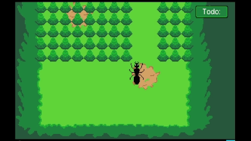

# My Queen, My Self
*A story game about the routine of a lonely ant.*

This is a story-based game where the player takes control of an ant, learns the truth about the past and determines the fate of this lonely ant.

You are an ant. You must look after this planet for your Queen.
Day in, day out you must manage the crops and gather energy. All for her.
But not everything is as it seems.
Will you succumb to your dreams or face the world?

There are 2 possible endings.
A story-based game by Rosen

[Demo Video]()

[Full Playthrough Video (Good End)]()

[Full Playthrough Video (Bad End)]()

## Features
- Keyboard controlled movement and actions
- You play as an ant
- During the day you complete tasks
- During the night you face your nightmares
- Story told through dialogue
- 8 Days to get through
- 2 Endings

## Controls
- WASD to move
- Press E to interact

## Installation
**Play on itch.io (either download or play the web version)**
- [Download the game on Itch.io](https://rosenrgd.itch.io/my-queen-my-self)

## Built With
- Unity
- Aseprite

## Credits
- Game design and programming by Evan Jarvis
- All art created in Aseprite by Evan Jarvis
- [Font](https://www.dafont.com/pixel-arial-11.font)
- Music:
  - [Menu Theme](https://opengameart.org/content/menu-loop)
  - [World Theme](https://opengameart.org/content/i-swear-i-saw-it-background-track)
  - [Dream Theme](https://opengameart.org/content/pursuit)
  - [Good Ending theme](https://opengameart.org/content/vampires-piano)
  - [Bad Ending theme](https://opengameart.org/content/warmth)
